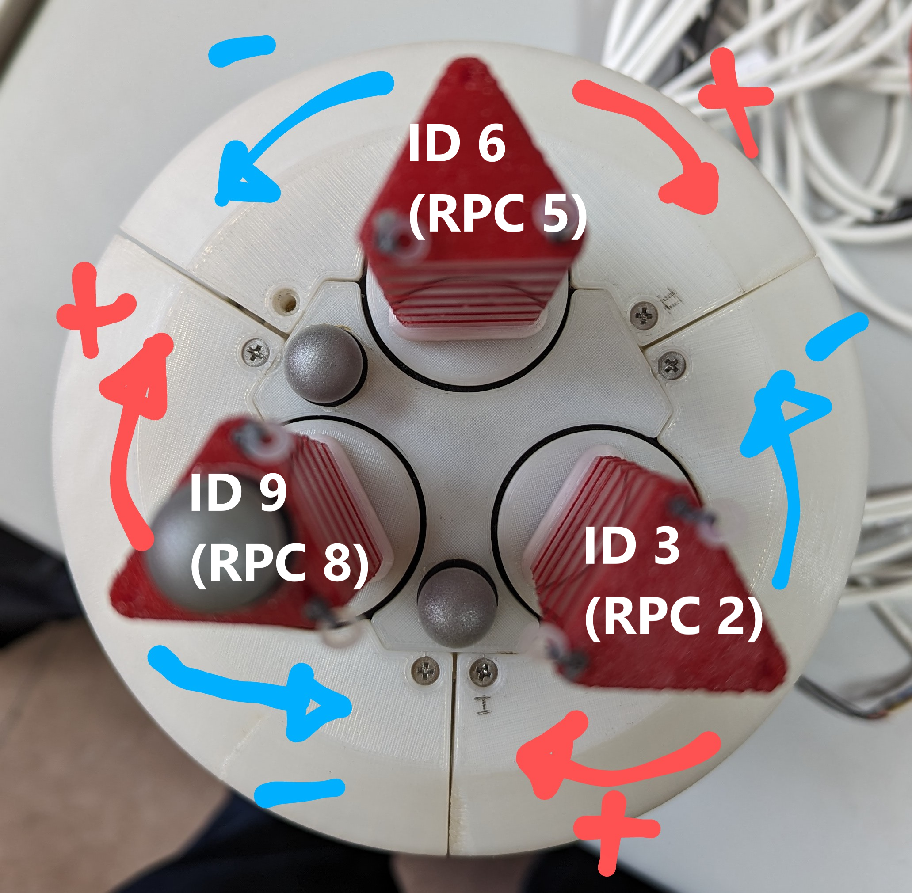

# Soft Gripper Demos

## Setup and Calibration

For the demos to work the best the finger's tendons need to be tightened first without the fingers curling excessively. A first approach can be done manually using the blue stick with the yellow head by sticking it through the honeycomb panels and rotating the encoders (black ring) on the desired sense. For tightening the tendons attached to the upper row of motors rotate the encoder counterclockwise. For those in the lower row, rotate clockwise.

{: style="height:400px"}
{: style="height:400px"}


1. Launch yarpserver with the following command.

    ```bash
    yarpserver --write
    ```
2. Setup the port for CAN communications at a baud rate of 1MHz with the following command.

    ```bash
    sudo ip link set can0 up txqueuelen 1000 type can bitrate 1000000
    ```
3. For checking that a communication has been stablished between the PC and the gripper use the candump command in a new terminal.

    ```bash
    candump can0 
    ```

4. Change directory to the required one for launching the can bus application in a new terminal.

    ```bash
    cd repos/sofia-yarp-devices/share/contexts/launchCanBus
    ```

5. Launch the CAN bus application.

    ```bash
    YARP_ROBOT_NAME=teoSoftGripper launchCanBus --from softGripper.ini
    ```
    
8. At this point you can turn on the Power Supply with a voltage of **24 V** and tense the tendons and align the fingers. This is done by means of the remote procedure calls (RPC). The RPC commands can be accessed through the following command:

    ```bash
    yarp rpc /teo/softgripper/rpc:i
    ```

You can tighten and untighten the tendons with the set pos command, which gives a distance(m) value for the motor to rotate. It is suggested to use increments or decrements of 0.01 as a starting value.

```text
set pos X 0.01
```

Where X is the Motor ID-1, as it starts with 0 instead of 1. A figure with the IDs and the rotation movements for each of the three base motors, one for each finger:



## Demo: Ball Juggling 


Throughout this section, the required steps to run the Space Navigator demo of the soft neck are described. 

1. Plug the spnav dongle the PC.
2. Plug the PCAN-USB adapter to the PC.
3. On a terminal, run the following command for setting up the CAN bus port:

```bash
cd ~/Desktop && sudo ./init_can.sh
```
This file contains the following command, which sets up the physical port at a baud rate of 1MHz:

```bash
ip link set can0 up txqueuelen 1000 type can bitrate 1000000 restart-ms 100
```

4. On a terminal, launch yarpserver through the following command:

```bash
yarpserver --write
```
5. Open the yarpgui for individually launching the different required applications. Press **Alt+F2** at the same time to pop up the command window and type **yarpmanager**. 
6. Open **SoftNeckControl_App** inside the Applications folder and launch the following apps in the described order by clicking the green launch button after selecting said app.
7. Launch SpaceNavigator.
8. Launch launchCanBus. At this point you can turn on the Power Supply with a voltage of 16V and tense the tendons through the easiest method. This is by means of the remote procedure calls (RPC). In order for this to work, the launchCanBus application needs to be launched. The RPC commands can be accessed through the following command:

```bash
yarp rpc /softneck/rpc:i
```

You can tighten and untighten the tendons with the set pos command, which gives a distance(m) value for the motor to rotate. It is suggested to use increments or decrements of 0.01 as a starting value.

```text
set pos 0 0.01
```

This will shorten the first tendon a length of 0.01m. The ID associated to each motor is shown in the following figure.

