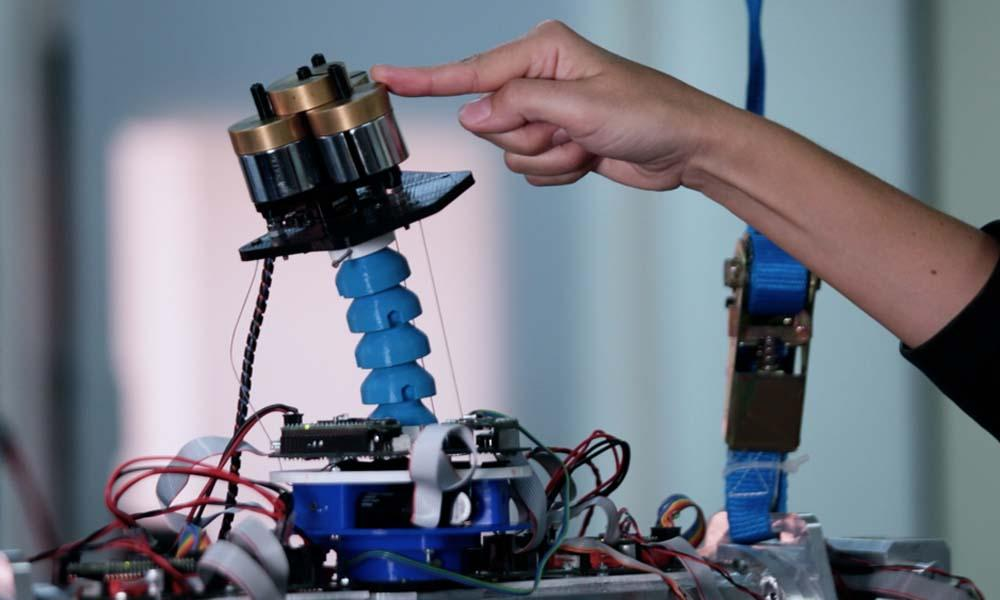

# Soft Neck Related Content

The following sections contain comprehensive guides and documentation for the soft neck.

* [Demo](demo.md)

#### List of publications:
 

Designed by since [2018](https://ruc.udc.es/dspace/bitstream/handle/2183/24937/2018_Luis_Nagua_A_first_approach_to_a_proposal_of_a_soft_robotic.pdf?sequence=3&isAllowed=y). The current version of this platform was presented along with an approach for the system identification using MLP techniques in [2022](https://www.researchgate.net/profile/Luis-Nagua-2/publication/365628027_IDENTIFICACION_DE_UN_CUELLO_ROBOTICO_BLANDO_MEDIANTE_APRENDIZAJE_AUTOMATICO/links/637bdd4f37878b3e87ccf019/IDENTIFICACION-DE-UN-CUELLO-ROBOTICO-BLANDO-MEDIANTE-APRENDIZAJE-AUTOMATICO.pdf). Further research on this robotic platform as well as the soft arm can be found [here](https://scholar.google.es/citations?hl=es&user=I6NYnWIAAAAJ&view_op=list_works&sortby=pubdate). 

Documentation of these researchs can be found both in [Humasoft](https://github.com/HUMASoft/soft-neck-control) and [SofIA](https://gitlab.com/uc3m-sofia/soft-neck-control) Gitlab and Github repositories.

