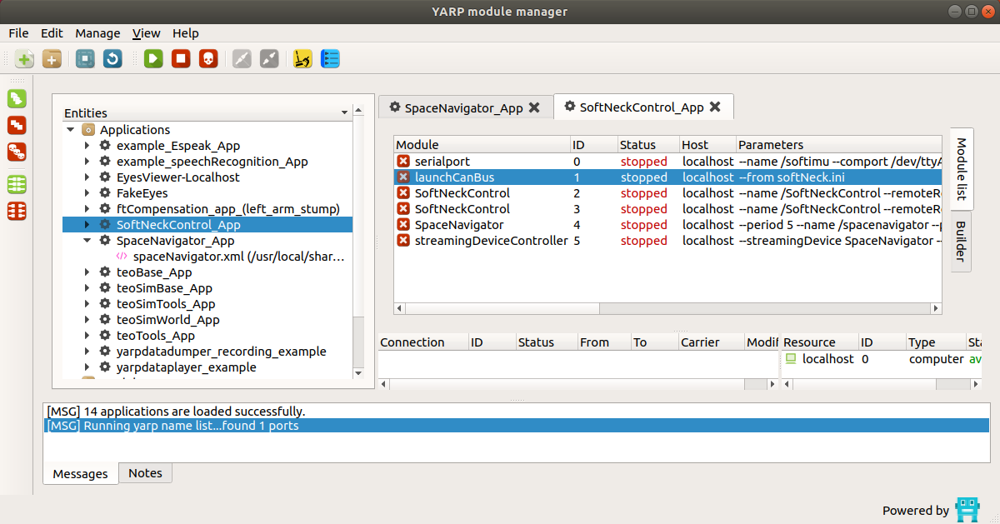
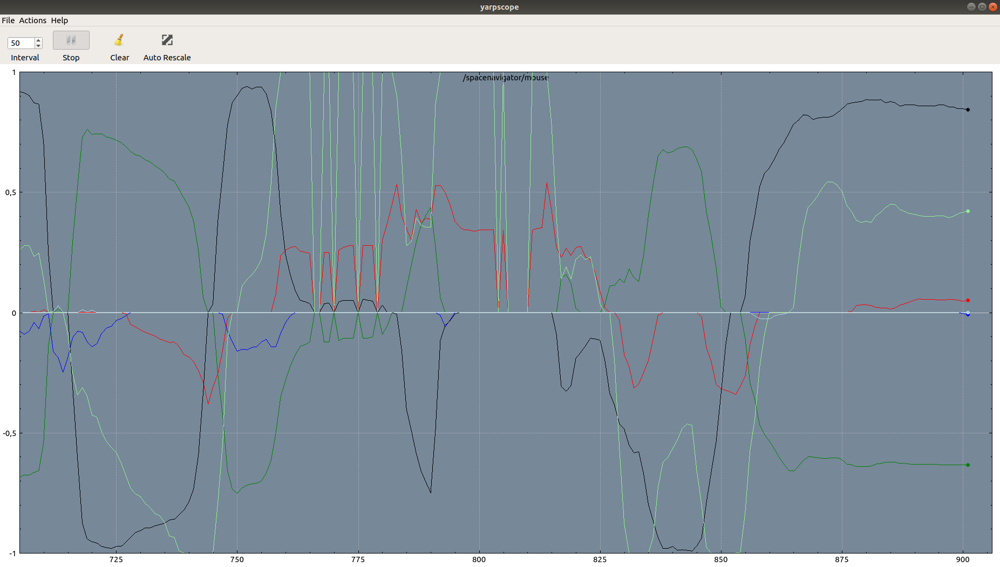

# Demo: Space Navigator (Inverse Kinematcs)

**The following steps are meant to be launched on the Soft Robotics PC, next to Lisbeth**

Throughout this section, the required steps to run the Space Navigator demo of the soft neck are described. 

1. Plug the spnav dongle the PC.
2. Plug the PCAN-USB adapter to the PC.
3. On a terminal, run the following [command](){#canbus-port-setup} for setting up the CAN bus port:

    ```bash
    cd ~/Desktop && sudo ./init_can.sh
    ```

    This file contains the following command, which sets up the physical port at a baud rate of 1MHz:
    ```bash
    ip link set can0 up txqueuelen 1000 type can bitrate 1000000 restart-ms 100
    ``` 

4. On a terminal, launch yarpserver through the following command:

    ```bash
    yarpserver --write
    ```

5. Open the yarpgui for individually launching the different required applications. Press **Alt+F2** at the same time to pop up the command window and type **yarpmanager**.  

    

6. Open **SoftNeckControl_App** inside the Applications folder and launch the following apps in the described order by clicking the green launch button after selecting said app.  
7. Launch SpaceNavigator.  
8. Launch launchCanBus. At this point you can turn on the Power Supply with a voltage of **16 V** and tense the tendons through the easiest method. This is by means of the remote procedure calls (RPC). The RPC commands can be accessed through the following command:

    ```bash
    yarp rpc /softneck/rpc:i
    ```

    You can tighten and untighten the tendons with the set pos command, which gives a distance(m) value for the motor to rotate. It is suggested to use increments or decrements of 0.01 as a starting value.

    ```text
    set pos 0 0.01
    ```

    This will shorten the first tendon a length of 0.01m. The ID associated to each motor is shown in the following figure.

    

9. Launch **SofNeckControl (the first of the two options)**.
10. Turn on the Space Navigator (A blue LED will start flashing) and launch **streamingDeviceController**.
11. Launch **yarpscope** for visualizing the inputs for the three motors through the following command:
    ```bash
    yarpscope --remote /spacenavigator/mouse --index "(0 1 2 3 4 5)" --color "(Red Green Blue LightRed LightGreen LightBlue)" --min -1 --max 1
    ```

    

## Additional Notes

You can troubleshoot any potential issues with the CAN bus by launching the following command and looking for the CAN bus errores messages in [here]().

```bash
candump can0
```

the port can0 is used as there is only one physical bus, which was setup on the [third step][canbus-port-setup]